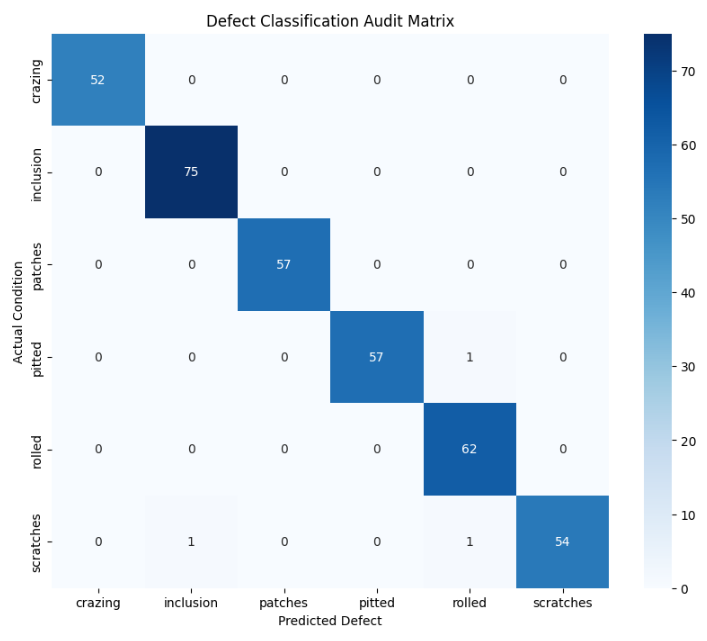
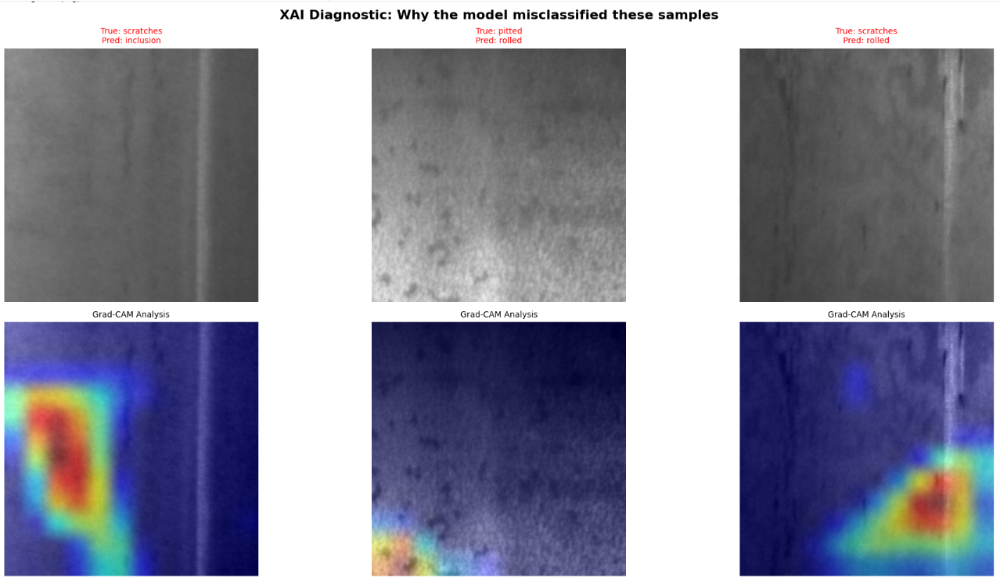
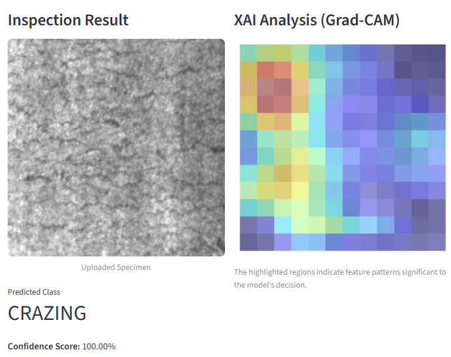

# Industrial Surface Defect Detection: VGG16 with Explainable AI (XAI)

> **Project Goal:** To build a high-reliability automated inspection system for steel surface defects using Transfer Learning and Grad-CAM visualization.

---

## 📖 Project Overview

In smart manufacturing, identifying surface defects with high precision and transparency is critical for quality assurance. This project develops an **Industrial Defect Audit System** using the **NEU Surface Defect Database**. By leveraging a **VGG16-based Transfer Learning** architecture and integrating **Grad-CAM (Gradient-weighted Class Activation Mapping)**, I achieved an overall **Accuracy of 99%** while providing visual evidence of the model's decision-making process.

---

## 🛠️ Tech Stack
* **Language:** Python
* **Deep Learning:** TensorFlow, Keras, VGG16 (Transfer Learning)
* **Explainable AI:** Grad-CAM (Visualizing Heatmaps)
* **Deployment:** Streamlit (Web Application), gdown (Cloud Asset Management)
* **Libraries:** NumPy, Pandas, Matplotlib, Seaborn, Scikit-learn

---

## 📈 Model Performance & Analysis

### **1️⃣ Classification Performance (Metric Report)**
The model was evaluated on a test set of 360 images across 6 defect classes. It achieved near-perfect scores, proving its readiness for industrial-grade inspection.

| Defect Class | Precision | Recall | F1-Score | Support |
| :--- | :---: | :---: | :---: | :---: |
| **Crazing** | 1.00 | 1.00 | 1.00 | 52 |
| **Inclusion** | 0.99 | 1.00 | 0.99 | 75 |
| **Patches** | 1.00 | 1.00 | 1.00 | 57 |
| **Pitted** | 1.00 | 0.98 | 0.99 | 58 |
| **Rolled** | 0.97 | 1.00 | 0.98 | 62 |
| **Scratches** | 1.00 | 0.96 | 0.98 | 56 |
| **Accuracy** | | | **0.99** | **360** |

* **Key Insight:** The model achieves a **1.00 F1-score** for 'Crazing' and 'Patches', indicating zero false positives and negatives for these critical defect types.

### **2️⃣ Error Analysis via Confusion Matrix**
To validate the model's robustness, I generated a Confusion Matrix to analyze misclassifications.

**
> *Note: Minor confusion was observed between 'Rolled' and 'Scratches' due to similar linear textures, which provides a direction for further data augmentation strategies.*

### **3️⃣ Explainable AI (XAI): Grad-CAM Integration**
The core differentiator of this project is the **interpretability** of the AI:

* **Visual Evidence:** Using Grad-CAM, the system generates a heatmap highlighting the exact area where the defect was detected.
**
> *Figure: Grad-CAM heatmap to analyze root causes of misclassifications.*

* **Reliability Validation:** As shown below, the **live deployment result** demonstrates how the model correctly focuses on the unique morphology of the 'Crazing' defect, validating that it's not relying on background noise.
**
> *Figure: An interactive session of the developed Streamlit application, showcasing a perfect prediction (100.00% confidence) and a precisely localized Grad-CAM heatmap for a 'Crazing' defect.*

---

* **Note on Dataset:** NEU Surface Defect Database.
* **Acknowledgment:** Code optimization, English terminology refactoring, and Technical documentation for this project were supported by **Google Gemini**.
