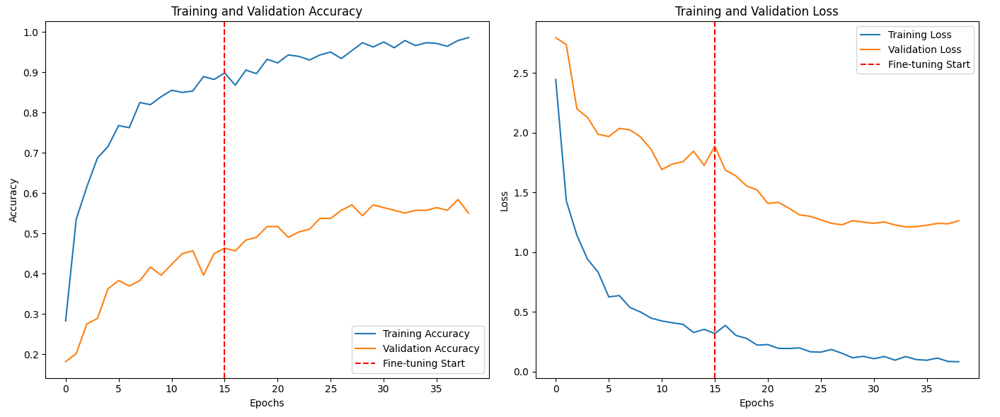

# Computer Vision Portfolio: From Foundation to Industrial AI

> **Repository Goal:** Showcasing the evolution of deep learning applications, moving from fundamental sign language recognition to a high-precision, explainable industrial defect inspection system.

---

## 📂 Project Roadmap & Overview

This repository demonstrates my journey in Computer Vision, focusing on **Transfer Learning (VGG16)** and **Model Interpretability**. I have progressed from academic classification tasks to deploying functional, industrial-grade AI solutions.

### 1. [Sign Language Digit Classification](./01_Sign_Language_Digits) (Foundation)
* **Target:** Accessibility tool for hearing-impaired communication.
* **Achievement:** Improved accuracy by **6x (10% → 67%)** through a **two-stage fine-tuning** strategy.
* **Focus:** Handling data scarcity and optimizing baseline CNNs.

### 2. [Industrial Surface Defect Detection](./02_Industrial_Defect_Detection) (Advanced/Featured)
* **Target:** Real-time steel surface quality audit system.
* **Achievement:** Achieved **99% Overall Accuracy** using the NEU Dataset.
* **Focus:** **Explainable AI (Grad-CAM)** integration and **Streamlit Cloud** deployment.

---

## 🛠️ Tech Stack
* **Language:** Python
* **Deep Learning:** TensorFlow, Keras, VGG16 (Transfer Learning)
* **Explainable AI:** Grad-CAM (Visualizing Heatmaps)
* **Deployment:** Streamlit (Web Application), gdown (Large model management)
* **Libraries:** NumPy, Pandas, Matplotlib, Seaborn, Scikit-learn

---

## 📉 Project 1: Sign Language Digit Classification

### **Two-Stage Training Strategy**
I implemented a robust fine-tuning pipeline to maximize learning from a small academic dataset.

1.  **Phase 1 (Feature Extraction):** Froze the VGG16 backbone to stabilize top-layer weights.
2.  **Phase 2 (Fine-Tuning):** Unfroze final convolutional blocks with a low learning rate ($10^{-5}$) for deep optimization.

**
> *Result: Successfully optimized the model to reach 67% accuracy despite data scarcity.*

---

## 📈 Project 2: Industrial Surface Defect Detection (XAI)

### **Classification Performance**
The model achieved near-perfect scores on the **NEU Surface Defect Database**, proving its readiness for industrial-grade inspection.

| Defect Class | Precision | Recall | F1-Score | Support |
| :--- | :---: | :---: | :---: | :---: |
| **Crazing** | 1.00 | 1.00 | 1.00 | 52 |
| **Inclusion** | 0.99 | 1.00 | 0.99 | 75 |
| **...** | **...** | **...** | **...** | **...** |
| **Accuracy** | | | **0.99** | **360** |

### **Explainable AI (Grad-CAM) & Live Deployment**
By integrating Grad-CAM, the system provides visual evidence for its decisions, ensuring transparency in smart manufacturing.

**
> *Figure: Streamlit interface showcasing 100% confidence and precise defect localization.*

---

## 💡 Key Learning & Insights
* **Model Interpretability:** Implementing Grad-CAM taught me the importance of **"Explainable AI"** in industrial sectors.
* **MLOps & Deployment:** Managing large `.keras` files via `gdown` and Streamlit Cloud provided hands-on experience in the end-to-end AI lifecycle.
* **Domain Adaptation:** Successfully adapted a **general-purpose** model (VGG16) to two completely **different domains**: human gestures and industrial steel surfaces.

---

* **Project Origin:** These projects represent my academic work at KNOU (2025) and professional portfolio development in Vancouver, WA (2026).
* **Acknowledgment:** English terminology refactoring, Technical documentation, and deployment optimization were supported by **Google Gemini**.
